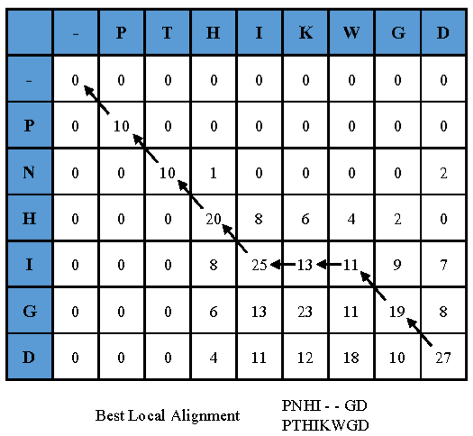
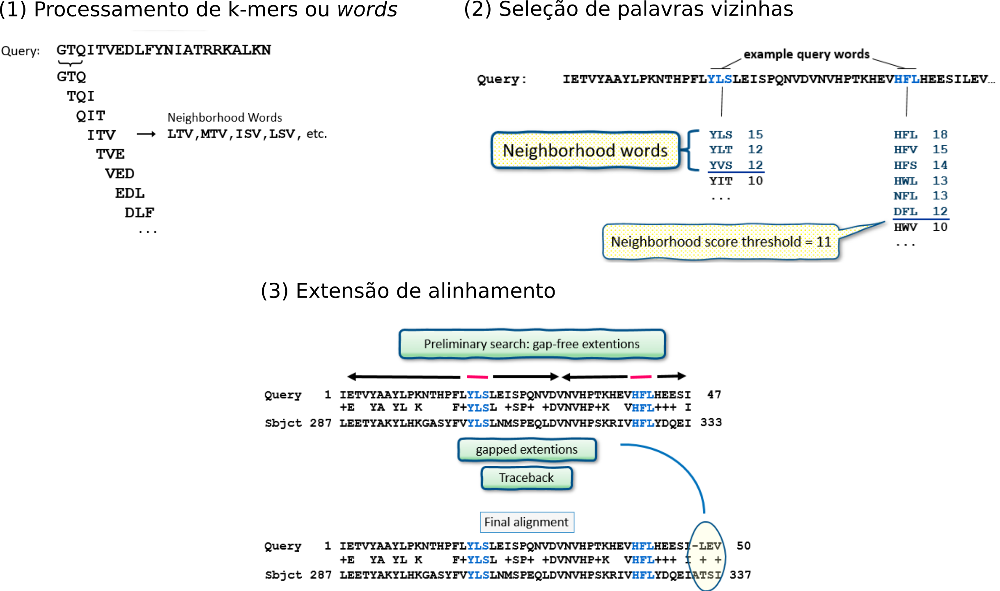
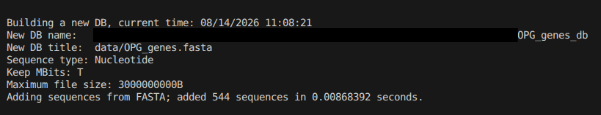
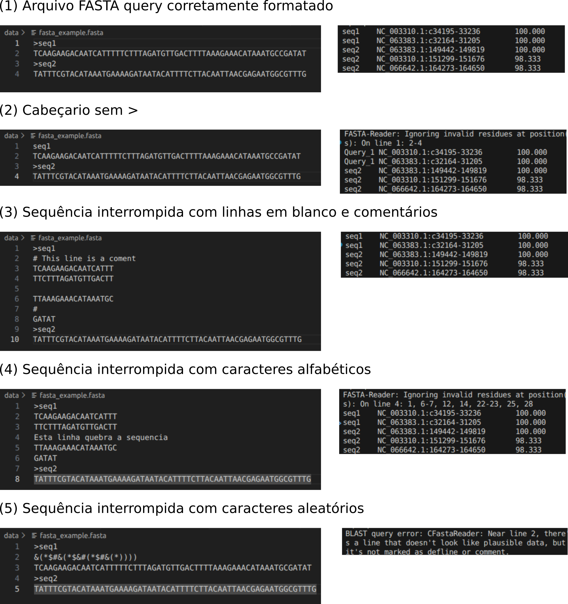

# BLAST na linha de comando

Neste repositório, apresentamos a ferramenta para BLAST na linha de comando como atividade da disciplina "Introdução à Biologia Computacional e Bioinformática".

## 1. Contexto Biológico
O Basic Local Alignment Search Tool (BLAST) é a ferramenta mais utilizada para a busca de similaridade local entre sequências biológicas (1). Ele alinea uma sequência de interesse, seja nucleotídeo, ou proteína, contra bancos de dados de sequências já caracterizadas, permitindo explorar as informações disponíveis para essa sequência (ou parte dela) [1,2]. Esta abordagem inicial possibilita identificar se a sequência já foi descrita e quais informações estão associadas a ela. Por meio das similaridades entre as sequências, é possível inferir funções biológicas, classificação taxonômica e outras propriedades com base na qualidade do alinhamento e no conhecimento prévio das sequências que estão sendo analisadas, fornecendo uma fonte de informação para estudos mais aprofundados [3].

O BLAST está disponível em um servidor web que permite realizar a busca de sequências nos bancos de dados do National Center for Biotechnology Information (NCBI). No entanto, a interface web apresenta limitações em projetos de grande escala, seja porque os bancos de dados disponíveis não são adaptáveis a perguntas específicas de pesquisa (organismos pouco estudados, dados sensíveis ou não públicos etc.) ou devido às restrições de processamento do próprio servidor [4]. Nesses casos, o BLAST pode ser executado localmente por meio do pacote ncbi-blast+. Neste trabalho, abordamos de maneira prática o uso do BLAST local na linha de comando, mostrando o uso básico dos principais programas ( ```blastn```, ```blastp```, ```blastx```, ```makeblastdb```).

## 2. Algoritmo
O BLAST baseia a busca de similaridade das sequências usando uma estratégia de seed-and-extend com matrizes de pontuação definidas. Para entender o processo, é importante definir dois tipos de sequência:
* Sequência query: Nossa sequência-alvo, que é desconhecida e a qual queremos comparar com bancos de dados.
* Sequência subject: A sequência (ou sequências) na qual realizamos a busca por similaridade. Elas conformam os bancos de dados.

### 2.1 Alinhamento de sequências
Antes do BLAST, o alinhamento de sequências era realizado por algoritmos como Needleman-Wunsch (global) e Smith-Waterman (local). Embora esses métodos garantam um alinhamento ótimo e satisfaçam as demandas iniciais, exigiam um alto custo computacional. Nesse contexto, o BLAST utiliza uma abordagem heurística que busca obter resultados próximos aos desses algoritmos, mas de forma rápida (5).

Para pontuar um alinhamento de duas sequências, o processo baseia-se em uma matriz. Essa matriz atribui pesos para casos de coincidência (match), diferenças (mismatch) e vazios/saltos (gaps) para sequências de DNA, ou matrizes de substituição (como BLOSUM ou PAM) para sequências de aminoácidos (6). Em ambos os casos, a ideia central é pontuar as coincidências e penalizar as diferenças e gaps. A Figura 1 exemplifica uma matriz de alinhamento mostrando o cálculo do score.



**Figura 1.** Matriz de alinhamento de duas sequências (PNHIGD vs. PTHIKWGD). Cada evento (match, mismatch, gap) possui uma pontuação previamente definida. Com a matriz preenchida, busca-se o caminho com os maiores scores (ressaltado com setas). Figura tomada de (7).

### 2.2 Algoritmo do BLAST
Na Figura 2, mostra-se um exemplo do processo de alinhamento de uma sequência de aminoácidos.



**Figura 2.** Processo de alinhamento heurístico do BLAST para sequências de aminoácidos. (1) leitura de query e formação dos k-mers. (2) busca e seleção das palavras vizinhas, com pontuação acima do limiar. (3) extensão do alinhamento a partir do sítio onde os k-mers e seus vizinhos foram encontrados. Figura adaptada de (8).

Na primeira etapa, a sequência query é dividida em subfragmentos de tamanho fixo chamados k-mers ou palavras (words). O tamanho dessa “palavra” é definido pelo parâmetro word size, com valores padrões de 28 e 3 para sequências de DNA e aminoácidos, respectivamente. O BLAST cria uma tabela hash na qual as palavras atuam como chaves, com o objetivo de melhorar o desempenho de consulta das posições e pontuações de cada palavra.

Em vez de alinhar a sequência completa logo no início, o algoritmo busca cada palavra contra as sequências do banco de dados (subject). O alinhamento só é processado em sequências que contêm essa palavra ou variações similares, chamadas palavras vizinhas (neighborhood words), para sequências de proteínas (em DNA busca coincidências exatas). A ocorrência de uma dessas palavras no banco de dados é chamada de hit (5).

O conceito de palavra vizinha significa que o algoritmo gera um hit não apenas com a palavra exata, mas também com palavras semelhantes para sequências de proteínas. Por exemplo, se uma das palavras for PQG, seus vizinhos podem ser PEG, PMG, PQA, entre outros. Cada um desses vizinhos (incluindo a palavra original) recebe uma pontuação obtida a partir das matrizes de substituição. O BLAST considera como hit as sequências no banco de dados que contêm o k-mer exato (em sequências de DNA) ou qualquer vizinho cuja pontuação supera um limiar pré-estabelecido (em proteínas) (5,6).

Quando um hit é encontrado no banco de dados, o algoritmo passa para a etapa de extensão (seed extension) expandindo o alinhamento nas duas direções. No início, essa extensão ocorre sem gaps (gap-free extension) e, depois, com gaps (gapped extension). À medida que o alinhamento é estendido, o score é continuamente recalculado, e se a pontuação cair abaixo de um determinado limite, a extensão é interrompida (5,8).

Em resumo, o BLAST não realiza uma busca exaustiva no banco de dados. Ele identifica regiões sementes (iguais ou muito semelhantes a subfragmentos da query) e, somente quando encontra essas coincidências, estende o alinhamento. Dessa forma, o algoritmo reduz o espaço de busca e o tempo de processamento necessário.

### Pacote ncbi-blast+
Para o uso em linha de comando, o BLAST disponibiliza o pacote de ferramentas ncbi-blast+ que contém diferentes programas de alinhamento a depender dos tipos de sequências comparadas (9):

| **Programa** | **Tipo de Query** | **Tipo de Subject** |
|---|---|---|
| `blastn` | Nucleotídeo | Nucleotídeo |
| `blastp` | Proteína | Proteína |
| `blastx` | Nucleotídeo | Proteína |
| `tblastn` | Proteína | Nucleotídeo |

Os programas `blastx` e `tblastn` envolvem passos adicionais de tradução da sequência de nucleotídeos para proteínas antes de realizar o alinhamento.

## 3. Requisitos computacionais
De acordo com a documentação oficial do NCBI, o pacote possui as seguintes dependências (1):
- SQLite: a partir do BLAST+ 2.15.0
- LMDB: a partir do BLAST+ 2.7.1
- Zstandard: a partir do BLAST+ 2.17.0
- Bzip2: a partir do BLAST+ 2.17.0
- Zlib: a partir do BLAST+ 2.17.0
- Visual Studio 2015 C++ redistributable runtime package: apenas para usuários do Windows 

## Arquivos de entrada e saída
Arquivos de entrada:
- Sequência de consulta (query): arquivo FASTA contendo uma ou mais sequências de interesse. 
- Sequência de consulta (subject) / banco de dados: arquivo no formato FASTA contendo a(s) sequência(s) alvo ou o nome de um banco de dados BLAST no qual a busca será realizada. 

Saída:
Na saída padrão (standard output) mostram-se os resultados dos alinhamentos das sequências de query com as de subject, no formato especificado. O formato de saída padrão é o mesmo visualizado no servidor web. Se o parâmetro `-out` é usado, ou a saída padrão é redirecionada com `>`, o resultado será salvo em um arquivo de texto.


## Execução

### Instalação

O pacote ncbi-blast+ pode ser instalado por diferentes vias e costuma já estar disponível como módulo pré-instalado em ambientes de Computação de Alto Desempenho (HPC). Recomenda-se verificar a melhor forma de instalação de acordo com os recursos computacionais disponíveis. Listamos algumas formas de instalação:
- Através do gerenciador de pacotes do Debian `apt`:
~~~bash
apt install ncbi-blast+
~~~
- Ambiente Conda, via canal bioconda:
~~~bash
conda install -c bioconda blast
~~~
- Executáveis pré-compilados via FTP do NCBI (https://ftp.ncbi.nlm.nih.gov/blast/executables/blast+/2.17.0/)
- Código-fonte: O código-fonte faz parte do toolkit `ncbi-c++-toolkit` hospedado no GitHub.


### Uso
Os programas `blastn`, `blastp`, `blastx` e `tblastn` requerem um arquivo FASTA de entrada (query) e um arquivo FASTA alvo (subject) ou o nome do banco de dados.

Execução utilizando dois arquivos FASTA:
~~~bash
blast<n,p,x> -query <fasta_input.fasta> -subject <subject.fasta>
~~~

Execução utilizando um arquivo FASTA e um banco de dados:
~~~bash
blast<n,p,x> -query <fasta_input.fasta> -db <path_to_blast_db>
~~~

Por padrão, os programas exibem o resultado diretamente na saída padrão da tela (stdout). O resultado pode ser direcionado para um arquivo usando o operador `>` ou, de preferência, utilizando o parâmetro `-out` para salvar o resultado em um arquivo de texto:
~~~bash
blast<n,p,x> -query <fasta_input.fasta> -db <path_to_blast_db> -out <out_file_name>
~~~
### Formato de saída
O programa permite exibir e salvar o resultado dos alinhamentos em diferentes formatos de saída através do parâmetro `-outfmt`, que aceita valores de 0 até 18:
- Formato padrão (`-outfmt 0`): Exibe um resultado visual do alinhamento similar ao layout da interface web do NCBI BLAST. 
- Formato tabular sem cabeçalho (`-outfmt 6`): Mais utilizado para análises computacionais e pipelines, gera um formato tabular e permite customizar quais colunas serão exibidas. No entanto, não inclui uma linha de cabeçalho com os nomes das colunas.
- Formato tabular com comentários (`-outfmt 7`): Também mostra um resultado tabular, porém inclui linhas intermediárias de comentários (iniciadas por `#`), contendo metadados do alinhamento. 

De acordo com a documentação oficial (9), quando as colunas não são especificadas no parâmetro, o programa mostra as seguintes colunas nesta ordem:

| Coluna   | Descrição                                         |
|----------|---------------------------------------------------|
| qseqid   | Identificador da sequência query                  |
| sseqid   | Identificador da sequência subject                |
| pident   | Percentual de identidade                          |
| length   | Tamanho do alinhamento                            |
| mismatch | Número de mismatches                              |
| gapopen  | Número de aberturas de gaps                       |
| qstart   | Posição inicial do alinhamento na sequência query |
| qend     | Posição final do alinhamento na sequência query   |
| sstart   | Posição inicial do alinhamento na sequência subject|
| send     | Posição final do alinhamento na sequência subject  |
| evalue   | Expect value (E-value) (valor estatístico)        |
| bitscore | Pontuação de alinhamento normalizada              |


Exemplo de execução especificando as colunas:
blast<n,p,x> -query <fasta_input.fasta> -db <path_to_blast_db> \
            -out <out_file_name> \
            -outfmt "6 qseqid sseqid pident length mismatch gapopen qstart qend sstart send evalue bitscore"

### Criar banco de dados BLAST com o `makeblastdb`

É possível criar um banco de dados local a partir de um arquivo FASTA próprio utilizando o programa `makeblastdb`. Criar um banco de dados BLAST é recomendado quando se planeja realizar buscas frequentes ou trabalhar com grandes volumes de dados, acelerando o tempo de processamento das consultas.

O processo de criação do banco de dados gera diversos arquivos complementares (.ndb, .nhr, .nin, .njs, .not, .nsq, .ntf, .nto, entre outros). Por isso, recomenda-se organizar o banco de dados dentro de um diretório específico.

Para criar um banco de dados a partir de um arquivo FASTA, utiliza-se o parâmetro `-dbtype` para definir se as sequências são de nucleotídeos ou de aminoácidos:

~~~bash
makeblastdb -in <subject.fasta> -dbtype <nucl,prot> -out <output_path/db_name>
~~~

Uma vez concluído, o programa mostra na saída padrão o tempo de processamento, o número de sequências indexadas e o nome final do banco criado (Figura 3).


**Figura 3.** Exemplo de saída (output) devolvida pelo `makeblastdb`.


## Monitoramento
Os programas `blastn`, `blastp`, `blastx` e `tblastn` não exibem mensagens de progresso durante sua execução. Se o processamento ocorrer normalmente e sem erros, o programa não mostra nada no terminal, inclusive até a sua conclusão.

Assim, o monitoramento do progresso deve ser implementado pelo usuário, adicionando aos scripts blocos de controle ou mensagens informativas. Também é recomendado criar etapas de verificação para checar se os arquivos de saída foram gerados e se contêm dados, já que é possível que o resultado seja completamente vazio.


## Logs e erros
Os programas do BLAST têm um certo nível de tolerância em relação à formatação do arquivo FASTA de entrada. Dependendo da alteração no arquivo, o programa pode apenas emitir alertas para sequências problemáticas, continuando com o processamento, ou interromper a execução com um erro.

O formato FASTA padrão consta de uma linha de cabeçalho iniciada pelo caractere `>` seguida por uma ou múltiplas linhas com a sequência. A Figura 4 mostra os avisos e erros na saída padrão (stdout) do `blastn` usando arquivos FASTA com alterações fora do padrão.


**Figura 4.** Warnings e erros no stdout do `blastn` sob diferentes alterações no arquivo query. A coluna da esquerda mostra o arquivo FASTA com diversas variações, e a da direita, o respectivo resultado no terminal: (1) Execução padrão com arquivo FASTA corretamente formatado; (2) cabeçalho sem o caractere `>`; (3) inserção de linhas em branco e comentários (`#`) no meio da sequência; (4) inserção de texto no meio da sequência; e (5) inserção de linha com caracteres especiais. Em todos os casos, exceto no (5), o programa processa as sequências válidas.

Quando a linha não inicia com `>`, o programa não reconhece o nome da sequência e passa a tratar o próprio texto como parte dela, ignorando caracteres inválidos, atribuindo um nome genérico e gerando um aviso de resíduos inválidos (Figura 4.2). Se a sequência for interrompida por linhas em branco ou iniciadas por `#`, o programa ignora essas linhas e processa a sequência normalmente, sem emitir avisos (Figura 4.3). Ao inserir uma linha de texto no meio da sequência (ex.: "Esta linha quebra a sequência"), esta é interpretada como parte da sequência, sendo analisada enquanto se ignoram os resíduos inválidos (Figura 4.4). O programa só interrompe a execução quando encontra uma linha com caracteres especiais e símbolos. Neste cenário, é exibido um erro de leitura e a execução é abortada (Figura 4.5).

## Automação

O `blast<x,p,n>` tem o parâmetro `-num_threads` que permite definir o número de threads para processamento em paralelo. Para o processamento de múltiplos arquivos de entrada, é possível utilizar laços de repetição (loops).

Exemplo de execução usando o parâmetro `-num_threads`:
~~~bash
for fasta_file in $PATH_TO_DATA/fasta_files/*.fasta; do
    # Get the base name of the fasta file (without path and extension)
    base_name=$(basename "$fasta_file" .fasta)

    # Run BLAST search against the OPG genes database
    blastn -query "$fasta_file" -db $PATH_TO_RESULTS/OPG_blast_db/OPG_genes_db \
                                -out $PATH_TO_RESULTS/blast_results/"$base_name"_blast_results.txt \
                                -evalue 1e-5 -num_threads 4 -max_target_seqs 5 \
                                -outfmt 6
done
~~~

## Interpretação de resultados
No formato de saída tabular, cada linha do arquivo representa um alinhamento. A partir desse resultado, pode-se obter a localização exata de quais sequências e regiões da subject (sstart, send) alinharam-se com a sequência de consulta query (qstart, qend). Além da localização, têm-se métricas como o percentual de identidade (pident), que é a porcentagem de posições com resíduos idênticos na região que foi alinhada, o comprimento do alinhamento (length), o número de mismatches e a abertura de gaps.

Com essas informações, junto ao metadado associado ao banco de dados utilizado, é possível inferir dados sobre a sequência query dado o grau de similaridade (e qualidade do alinhamento) com a sequência subject.


## Métricas estatísticas
O alinhamento do BLAST também mostra o bit-score e o expect value (E-value). O bit-score é a pontuação obtida do alinhamento entre as sequências (derivado das matrizes de substituição ou pesos de match/mismatch/gap) de forma normalizada. O processo de normalização permite comparar diretamente a qualidade de alinhamentos vindos de diferentes buscas e parâmetros (ex.: usando diferentes matrizes de substituição) (9).

O E-value é uma métrica que descreve o número de alinhamentos com a mesma pontuação que se esperaria encontrar no banco de dados por acaso. O cálculo deste valor considera a pontuação do alinhamento (bit-score) e o tamanho do banco de dados pesquisado (9). Esta métrica tenta responder à pergunta: “este alinhamento ocorre porque as duas sequências realmente são similares ou por aleatoriedade?”. Quanto menor o valor (mais próximo de zero), maior é a significância estatística do alinhamento. Esta métrica é amplamente usada como filtro de qualidade do alinhamento, junto ao percentual de identidade e ao comprimento.


## Limitações
O BLAST possui limitações importantes que devem ser consideradas na análise de dados. Por ser um alinhamento local, ele não é o método ideal para alinhar sequências grandes (como genomas), tarefas para as quais existem algoritmos específicos.

Também, os resultados do BLAST fornecem uma abordagem inicial de identificação, que deve ser acompanhada por outras evidências para inferir funções, anotações, taxonomias, entre outros.

O programa retorna métricas sobre o quão similares duas sequências são e a qualidade desse alinhamento. No entanto, o BLAST não atesta homologia (ancestralidade comum) por si só. A similaridade é um dado medido pelo algoritmo, enquanto a inferência de homologia depende do contexto biológico e evolutivo das sequências que estão sendo comparadas.

## Exemplo prático: Padronização de nomenclatura de genes por alinhamento

Os genomas depositados no NCBI abrangem sequências obtidas ao longo de décadas. Devido à evolução das tecnologias e métodos de análise, a forma como os genes foram anotados muda entre organismos da mesma família. Em muitos casos, o mesmo gene recebe identificadores e nomes totalmente diferentes. Essa divergência dificulta a extração automática de dados e análises comparativas entre grupos taxonômicos.

Esse era o problema em genomas da família Orthopoxvirus. Em 2021, foi estabelecida uma nomenclatura padronizada chamada Orthopoxvirus Genes (OPG) (10). No entanto, nem todos os genomas disponíveis nos bancos de dados têm essa nomenclatura, tornando necessária a sua padronização. Para isso, utilizou-se o BLAST como ferramenta de reanotação por similaridade.

Dados de entrada:
- OPG_genes.fasta: arquivo contendo sequências de referência com a nomenclatura oficial OPG.
- fasta_files.tar.gz: arquivo compactado contendo as sequências de genes de 500 genomas da família Orthopoxvirus.

Estratégia:
1. Criar um banco de dados local com os genes OPG via `makeblastdb`.
2. Alinhar os genes (obtidos dos 500 genomas) contra o banco de dados usando `blastn`.
3. Filtrar os resultados aplicando os seguintes critérios:
   - Percentual de identidade >= 80%
   - Cobertura >= 90%
   - E-value <= 1e-5

As sequências que atingiram estes critérios de alinhamento foram rotuladas com o OPG correspondente. 

## Execução do exemplo 

Na pasta `src` deste repositório, há dois scripts para rodar o exemplo:

- `install_blast_conda.sh`: Cria o ambiente Conda e instala a versão mais recente do BLAST.
- `running_example.sh`: Gera o banco de dados BLAST a partir do arquivo `OPG_genes.fasta` e executa a busca do `blastn` para as sequências do conjunto de dados.

Para reproduzir o exemplo prático, basta executar os seguintes comandos no terminal:

~~~bash
bash src/install_blast_conda.sh
bash src/running_example.sh data blast_results
~~~

## Referencias
1.	BLAST® Command Line Applications User Manual. National Center for Biotechnology Information (US); 2008. 
2.	The NCBI Handbook. 2nd ed. National Center for Biotechnology Information (US); 2013. 
3.	Weisman CM, Murray AW, Eddy SR. Many, but not all, lineage-specific genes can be explained by homology detection failure. PLOS Biol. 2020 Nov 2;18(11):e3000862. doi:10.1371/journal.pbio.3000862 
4.	How many sequences can I enter in a single BLAST search? · NLM Customer Support Center [Internet]. [cited 2026 Aug 11]. Available from: https://support.nlm.nih.gov/kbArticle/?pn=KA-03289 
5.	Lobo I. Basic Local Alignment Search Tool (BLAST). Vol. 215. 2008;215(1). 
6.	Wheeler D, Bhagwat M. BLAST QuickStart. In: Comparative Genomics: Volumes 1 and 2 [Internet]. Humana Press; 2007 [cited 2026 Aug 13]. Available from: https://www.ncbi.nlm.nih.gov/books/NBK1734/ PubMed PMID: 17993672. 
7.	Xu B, Li C, Zhuang H, Wang J, Wang Q, Zhou X. Efficient Distributed Smith-Waterman Algorithm Based on Apache Spark. In: 2017 IEEE 10th International Conference on Cloud Computing (CLOUD) [Internet]. Honolulu, CA, USA: IEEE; 2017 [cited 2026 Aug 14]. p. 608–15. Available from: http://ieeexplore.ieee.org/document/8030640/ doi:10.1109/CLOUD.2017.83 
8.	How BLAST Works [Training Material and Manuals] [Internet]. U.S. National Library of Medicine; [cited 2026 Aug 13]. Available from: https://www.nlm.nih.gov/ncbi/workshops/2022-10_Basic-Web-BLAST/how-blast-works.html 
9.	BLAST® Command Line Applications User Manual. National Center for Biotechnology Information (US); 2008. 
10.	Senkevich TG, Yutin N, Wolf YI, Koonin EV, Moss B. Ancient Gene Capture and Recent Gene Loss Shape the Evolution of Orthopoxvirus-Host Interaction Genes. mBio. 2021 Jul 13;12(4):10.1128/mbio.01495-21. doi:10.1128/mbio.01495-21 


